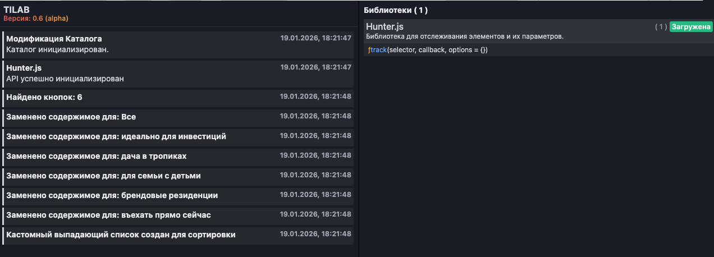

<p align="center">

</p>
<div align="center">


[](https://nextjs.org)
[](https://directus.io)

</div>

# TiLab.js

Легкий набор модулей для разработки и отладки модификаций на платформе Tilda.
Данный проект привносит новый подход в виде JSX синтаксиса.

## Установка

В настройках проекта/сайта подключить библиотеку в секцию `HEAD`

```html
<script src="https://cdn.abros.dev/tilab/tilab.js"></script>
```

После подключения в `window` появляется объект `TiLab`.

## Модули и API

### Панель отладки

Для включения панели отладки добавьте параметр `?tilab` к URL:

```
https://example.com/?tilab
```

Панель отображает:

- Логи TiLab
- Логи созданные через TiLab
- Список подключенных библиотек через TiLab



---

### Cборщик логов

Собственный сборщик логов для удобного просмотра.

Формат вызова:

```javascript
TiLab.console.<type>("name", "message", data)
```

- `<type>` (обязательный) - тип логирования. (`log`, `info`, `trace`, `warn`, `error`)
- `name` (обязательный) - заголовок или источник события
- `message` (обязательный) - текст сообщения
- `data` (опционально) - любые дополнительные данные

---

### Загрузчик библиотек

Каждая библиотека в TiLab загружается через собственный загрузчик, что делает точку входа легче и оптимизированее.

Формат вызова:

```javascript
TiLab.lib.init("library", ({ func1, func2 }) => {
  func1(param);
});
```

- `library` (обязательный) - библиотека
- `func` или `{func1, func2, ...}` (опционально) - какие функции из библиотеки хотите использовать.

---

### JSX

Данный модуль основан на Preact/htm и передает утилиты в коллбэк `TiLab.jsx`.

Поддерживаются:

- DOM-слой
  - `render` - монтирование дерева в DOM-узел
  - `html` - шаблонные строки htm для JSX-подобной разметки
  - `Component` - базовый класс компонентов Preact
  - `h` - фабричный хелпер (аналог `React.createElement`)
  - `useState` - локальное состояние компонента
  - `useEffect` - побочные эффекты и подписки
  - `useRef` - мутабельные ссылки на значения/DOM
  - `useMemo` - мемоизация вычислений
  - `useCallback` - мемоизация функций
  - `useContext` - доступ к контексту
  - `createContext` - создание контекста
- Query-слой
  - `useQuery({ queryKey, queryFn, enabled, staleTime, cacheTime, retry, retryDelay, refetchOnWindowFocus, refetchOnReconnect })`
  - `useMutation({ mutationFn, onMutate, onSuccess, onError, onSettled, retry, retryDelay })`

`useQuery` автоматически делает refetch при фокусе окна и восстановлении сети (можно отключить флагами).
`useMutation` поддерживает оптимистические обновления через `onMutate` (можно вернуть `rollback`).

Пример использования:

```javascript
TiLab.jsx(({ html, render, useEffect, useState, useQuery }) => {
  function App() {
    const [time, setTime] = useState(new Date().toLocaleTimeString());
    useEffect(() => {
      const id = setInterval(
        () => setTime(new Date().toLocaleTimeString()),
        1000,
      );
      return () => clearInterval(id);
    }, []);

    const { data, isLoading } = useQuery({
      queryKey: ["status"],
      queryFn: () => Promise.resolve({ ok: true }),
      staleTime: 10 * 1000,
    });

    return html`
      <div>
        Время: ${time}
        <div>Статус: ${isLoading ? "..." : data.ok ? "ok" : "fail"}</div>
      </div>
    `;
  }

  render(html`<${App} />`, document.body);
});
```
